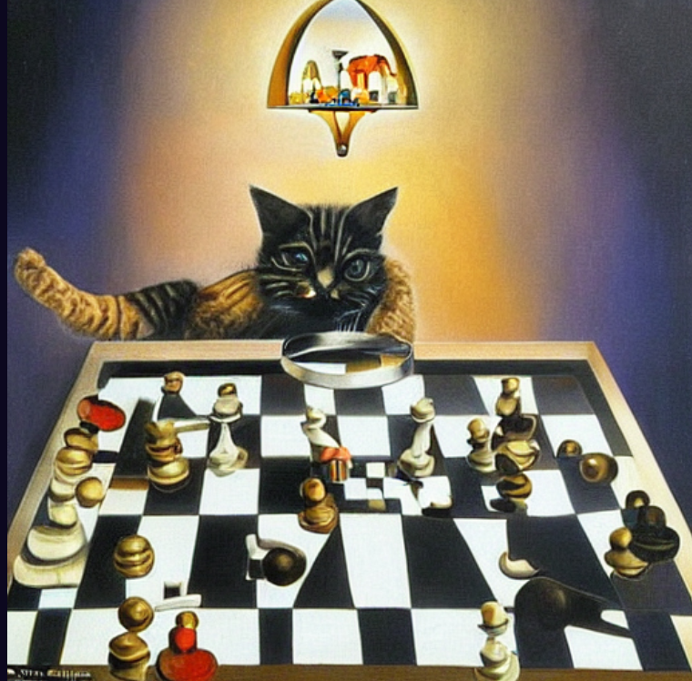

<h1 align="center">ImagicaAI</h1>

  

## Overview

ImagicaAI is a SaaS platform designed for generating high-quality images using the OpenAI API. This platform enables users to create stunning visuals by leveraging advanced AI algorithms. ImagicaAI is built on the MERN stack, ensuring robust performance and a seamless user experience.

## Features

- **AI-Powered Image Generation:** Utilize OpenAI's cutting-edge technology to create unique and high-quality images.
- **User-Friendly Interface:** An intuitive UI that allows users to easily generate and download images.
- **Customization Options:** Users can tweak parameters to tailor the generated images to their needs.
- **Real-time Processing:** Fast and responsive image generation with real-time feedback.

## Tech Stack

- **Frontend:** React.js, Tailwind CSS
- **Backend:** Node.js, Express.js
- **Database:** MongoDB
- **API:** OpenAI API

## Screenshots

### Home Page

  

### Image Generation Page

  

### Results Display

  
  
  

